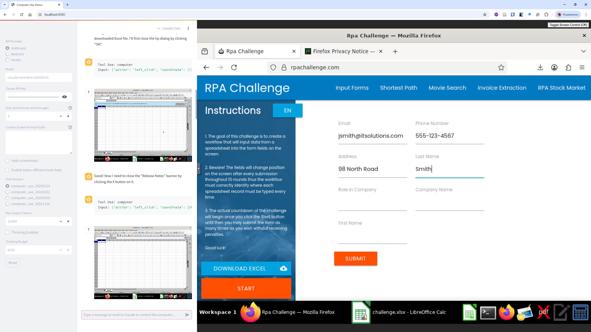
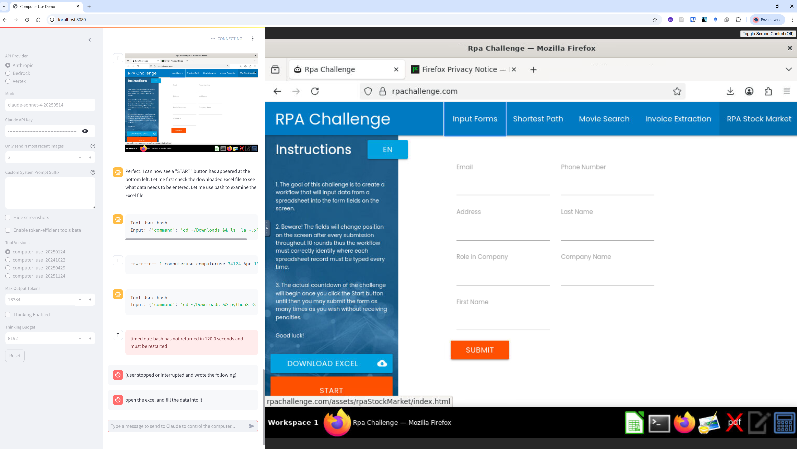

# Supporting Screenshots: LLM Agent Tool Failures

These screenshots document recurring failure modes observed during RPA Challenge experiments using LLM-driven automation agents. They serve as supplementary evidence for the manuscript.

---

## 1. App Freeze During Connecting

**File:** `app_freeze_on_connecting.png`

The tool enters a frozen state during the initial connection phase. Although the RPA Challenge website has fully loaded in the browser (showing the input form at rpachallenge.com), the agent tool on the left panel stalls and fails to proceed past the connection/initialization step. The workflow never starts executing.

---

## 2. App Freeze with Error

**File:** `app_freeze_with_error.png`

The tool reaches a deeper execution stage but then halts completely, producing an error message visible in the activity log (highlighted in red at the bottom of the left panel). The browser remains idle on the RPA Challenge form. The agent stops responding to further inputs and must be manually restarted.

---

## 3. App Running But Inactive

**File:** `app_running_but_inactive.png`

The most deceptive failure mode: the tool reports an active running state in the left panel, yet the web form on rpachallenge.com remains completely empty and untouched. The agent appears to execute internally but produces no observable actions in the browser. No fields are filled, no submission occurs, and no error is raised — the process silently fails.

---

## Summary of Failure Modes

| Screenshot | Failure Type | Observable Symptom |
|---|---|---|
| `app_freeze_on_connecting.png` | Connection freeze | Tool stalls before workflow starts |
| `app_freeze_with_error.png` | Runtime freeze with error | Tool halts mid-execution, logs an error |
| `app_running_but_inactive.png` | Silent inactivity | Tool reports running, browser form stays empty |
